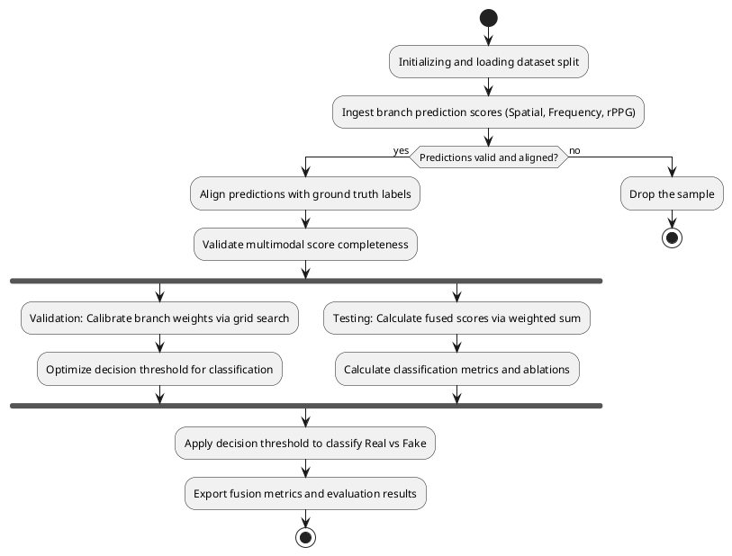

# UML Activity Diagram: Fusion Layer

---

## Black and White Activity Diagram (No Numbers, Zero Overlap)

```mermaid
flowchart TD
    %% Global Styling - Strictly Black and White
    classDef bw fill:#ffffff,stroke:#000000,stroke-width:1.5px,color:#000000;
    classDef initialNode fill:#000000,stroke:#000000,stroke-width:2px;
    classDef finalNode fill:#ffffff,stroke:#000000,stroke-width:2px;

    %% 1. Start Node
    START(( )):::initialNode

    %% 2. Initialization
    INIT["Initializing and loading<br/>dataset split"]:::bw
    START --> INIT

    %% 3. Ingestion
    INGEST["Ingest branch prediction scores<br/>(Spatial, Frequency, rPPG)"]:::bw
    INIT --> INGEST

    %% 4. Decision Diamond
    CHECK{"Predictions valid<br/>and aligned?"}:::bw
    INGEST --> CHECK

    %% Drop on separate outer column
    DROP["Drop the sample"]:::bw
    CHECK -->|NO| DROP

    %% 5. Alignment & Verification
    ALIGN["Align predictions with<br/>ground truth labels"]:::bw
    VERIFY["Validate multimodal<br/>score completeness"]:::bw
    CHECK -->|YES| ALIGN
    ALIGN --> VERIFY

    %% Parallel Subgraphs
    subgraph Calibration ["Validation Calibration"]
        direction TB
        VAL_OPT["Validation: Calibrate branch<br/>weights via grid search"]:::bw
        VAL_THRESH["Optimize decision threshold<br/>for classification"]:::bw
        VAL_OPT --> VAL_THRESH
    end

    subgraph Testing ["Testing Evaluation"]
        direction TB
        TEST_FUSE["Testing: Calculate fused<br/>scores via weighted sum"]:::bw
        TEST_METRICS["Calculate classification<br/>metrics and ablations"]:::bw
        TEST_FUSE --> TEST_METRICS
    end

    VERIFY --> Calibration
    VERIFY --> Testing

    %% Classification & Export
    CLASSIFY["Apply decision threshold<br/>to classify Real vs Fake"]:::bw
    EXPORT["Export fusion metrics<br/>and evaluation results"]:::bw

    VAL_THRESH --> CLASSIFY
    TEST_METRICS --> CLASSIFY
    CLASSIFY --> EXPORT

    %% Final Node (Bullseye)
    END_NODE((( ))):::finalNode
    EXPORT --> END_NODE
    DROP ---> END_NODE
```

---

## PlantUML Equivalent

```plantuml
@startuml
skinparam monochrome true
skinparam shadowing false
skinparam defaultFontName Arial

start
:Initializing and loading dataset split;
:Ingest branch prediction scores (Spatial, Frequency, rPPG);

if (Predictions valid and aligned?) then (yes)
  :Align predictions with ground truth labels;
  :Validate multimodal score completeness;
  
  fork
    :Validation: Calibrate branch weights via grid search;
    :Optimize decision threshold for classification;
  fork again
    :Testing: Calculate fused scores via weighted sum;
    :Calculate classification metrics and ablations;
  end fork

  :Apply decision threshold to classify Real vs Fake;
  :Export fusion metrics and evaluation results;
  stop
else (no)
  :Drop the sample;
  stop
endif
@enduml
```
